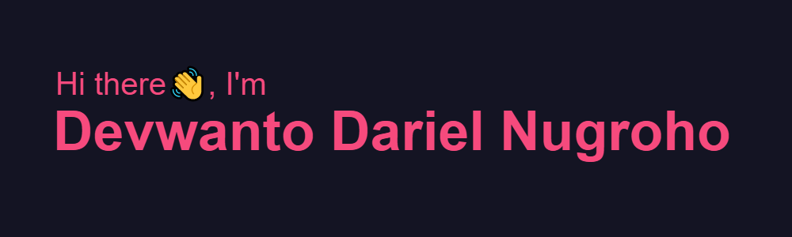

<h3 align="left">About Me:</h3>

  - 🎓 3rd year Computer Science student
  - 🤔 I’m currently looking for an internship
  - 🔭 I’m currently working on something *wink wink*
  - 🌱 I’m currently learning Internet of Things and Golang
  - 👯 I’m looking to collaborate on building mobile apps
  - ⚡ Fun fact: I love everythink pink
  
<h3 align="left">Languages and Tools:</h3>

          

 

<!--
**fortoszone/fortoszone** is a ✨ _special_ ✨ repository because its `README.md` (this file) appears on your GitHub profile.
-->
